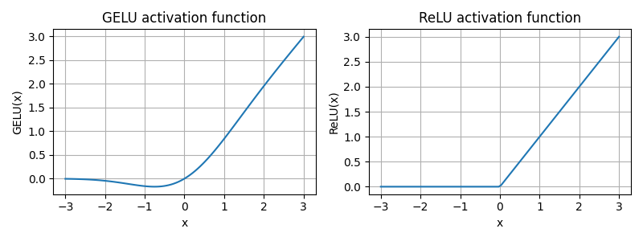

# Implementing a GPT model from scratch to generate text

We'll implnement GPT-2 small with 124 million parameters as described in "[Language Models Are Unsupervised Multitask Learners](https://mng.bz/yoBq)". 

The following are hyperparameters defining the model's architecture:
* **vocabulary size** - 50,257 tokens
* **context length** - 1024 the maximum number of input tokens the model can handle via the positional embeddings
* **embedding dimension** - 768 numbers will represent the meaning of each token.
* **number of heads** - 12 attention heads in the multi-head attention mechanism.
* **number of layers** - 12 transformer blocks.
* **drop rate** - the intensity of the dropout mechanism (0.1 implies a 10% random drop out of hidden units) to prevent overfitting.
* **query key value bias** - whether to include a bias vector in the Linear layers of the multi-head attention for query, key, and value computations. Initially disabled following the norms of modern LLMs, but we'll revisit later when loading pretrained GPT-2 weights.

## Normalizing activations with layer normalization

Vanishing and exploding gradients can pose challenges when training deep neural networks.

A *gradient* is a vector containing all partial derivatives of a multivariate function, a function with more than one variable as input. Partial derivatives measure the rate at which a function changes with respect to one of its variables.

*Layer normalization* improves the stability and efficiency of neural network training (faster convergence) by adjusting the activations (i.e. the outputs) of a neural network layer to have a mean of 0 and a variance of 1 (also known as "unit variance").

In GPT-2 and modern transformer architectures, layer normalization is typically applied before and after multi-headed attention, and before the final output layer.

Layer normalization consists of subtracting the mean and dividing by the square root of the variance (also known as the standard deviation).

Layer normalization enables **distributed training** since it normalizes along the embedding dimension instead of normalizing along the batch dimension like in *batch normalization*

## Implementing a feed forward network with GELU activations

A ReLU (rectified linear unit) activation function has traditionally been used in deep learning.

However, in LLM other activation functions are common such as GELU (gaussian error linear unit) and SwiGLU (swish-gated linear unit).

Both GELU and SwiGLU are more complex and smooth activation functions offering improved performance over ReLU.

The GELU activation function is defined GELU(x) = x * phi(x) where phi(x) is the cumulative distribution function of the standard Gaussian distribution. In practice, it's common to implement a computationally cheaper approximatinon:

$$GELU(x) \approx 0.5 \cdot x \cdot \left[1 + \tanh\left[\sqrt{\frac{2}{\pi}} \cdot (x + 0.044715 \cdot x^3)\right]\right]$$

The below plot shows ReLU (right) is a piecewise linear function that outputs the input directly if it is positive; otherwise, it outputs zero. GELU (left) is a smooth, nonlinear function that approximates ReLU but with a non-zero gradient for almost all negative values (except at approximately x = –0.75).

The smoothness of GELU can lead to better optimization properties during training, as it allows for more nuanced adjustments to the model's parameters. In contrast, ReLU has a sharp corner at zero, which can sometimes make optimization harder, especially in networks that are very deep or have complex architectures. Moreover, unlike ReLU, which outputs zero for any negative input, GELU allows for a small, non-zero output for negative values. This characteristic means that during the training process, neurons that receive negative input can still contribute to the learning process, albeit to a lesser extent than positive inputs.

The GELU function is used within the [feedforward neural network](https://en.wikipedia.org/wiki/Feedforward_neural_network) inside the transformer block of the model.

The feedforward neural network receives as input a matrix with shape [batch_size, sequence_length, embedding_dimension], and outputs a matrix with this same shape.

It's crucial for enhancing the model's ability to learn and generalize from data.

Internally, the model expands the embedding dimension by a factor of 4 (arbitrary, but conventional), 768 dimensions to 3,072 dimensions, then compresses the values back down into 768 dimensions as seen the following diagram:

The uniformity in input and output layers simplifies the architecture and lends itself to stacking of multiple layers and scalability.

## Adding shortcut connections

Shortcut connections, also known as skip or residual connections, improve training performance.

Originally proposed for deep networks in computer vision to mitigate vanishing gradients. Vanishing gradients refers to when gradients, which guide weight updates during training, become progressively smaller as they propagate backward through the layers making it difficult to train eariler layers.

Shortcut connections involve adding the output of one layer to the the output of a later layer effectively creating an alternate path bypassing certain layers as seen below:

See [Residual Networks and Skip Connections (DL 15)](https://www.youtube.com/watch?v=Q1JCrG1bJ-A) for more information.
